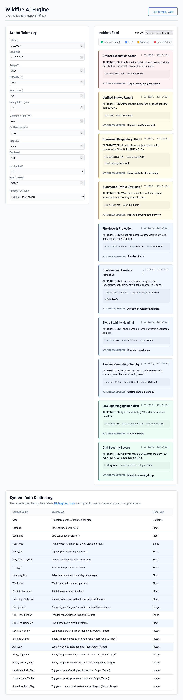

# Wildfire AI Pipeline



## How to Run

1. Make sure you have **Docker** running on your local machine (required for the underlying MS-SQL Server database environment).
2. We use `uv` for dependency management. Ensure `uv` is installed.
3. Open your terminal in the main project directory and run the fully automated entry script:
   ```bash
   uv run app.py
   ```
4. The script will automatically verify the Docker environment, safely generate 10,000 rows of synthetic data, and train 10 Random Forest and Logistic Regression models.
5. In your terminal, you will see a printed `MODEL EVALUATION REPORT`.
6. Right after the report, the **Flask Web UI** will start automatically on port 5000. 
7. Open a web browser and navigate directly to: `http://127.0.0.1:5000`. You can now interact with the live telemetry controls!
## Project Files

### Core Pipeline
- **`app.py`**: The main execution orchestrator (handles Docker checks, generative logic, MS-SQL loading, model training, and subsequently starts the web server).
- **`docker_sql_start.py`**: Python Docker SDK script that automatically ensures the local MS-SQL Server Docker container is running.
- **`db.py`**: Centralized utility containing `get_db_engine()` to facilitate standard MS-SQL connection pathways using `pyodbc` and SQLAlchemy.
- **`test_odbc.py`**: Utility script to check for an active Microsoft ODBC Driver installation.

### Machine Learning
- **`data_generator.py`**: Synthesizes 10,000 real-world correlated datapoints (weather, terrain, ignition actions) and injects them directly into the SQL table.
- **`models.py`**: Connects to the database and builds the 10 distinct predictive Scikit-Learn models via Logistic Regression and Random Forests.

### Web Server & Dashboard
- **`server.py`**: Flask web application routing. Serves the UI dashboard and safely exposes the `/api/briefing` predictive POST endpoint.
- **`briefings.py`**: Evaluates incoming POST sensor telemetry by routing it through all 10 trained AI models to dynamically return structured briefing cards.
- **`templates/index.html`**: Main HTML layout building the telemetry controls, incident feed array, and data dictionary.
- **`static/style.css`**: Styling directives forming a clean, flat-design enterprise visual aesthetic.
- **`static/app.js`**: Client-side reactive logic to immediately debouncedly POST updated values to the model endpoint upon any slider/field adjustment, dynamically injecting AI feedback DOM elements, and supporting logical priority sorting.

## Synthetic Data Architecture

To bypass the lack of a centralized, real-world wildfire database, `data_generator.py` programmatically generates a flattened dataset specifically engineered to train complex Machine Learning algorithms. The generator enforces strict logical correlations (e.g., high wind + low humidity + pine forests = major fires) to ensure the models learn realistic environmental physics.

### Full Data Dictionary

The synthetic data generator produces the following 22 columns upon execution:

| Column Name | Description | Data Type |
| :--- | :--- | :--- |
| Date | Timestamp of the simulated daily log | Datetime |
| Latitude | GPS Latitude coordinate | Float |
| Longitude | GPS Longitude coordinate | Float |
| Fuel_Type | Primary vegetation (Pine Forest, Grassland, etc.) | String |
| Slope_Pct | Topographical incline percentage | Float |
| Soil_Moisture_Pct | Ground moisture baseline percentage | Float |
| Temp_C | Ambient temperature in Celsius | Float |
| Humidity_Pct | Relative atmospheric humidity percentage | Float |
| Wind_Kmh | Wind speed in kilometers per hour | Float |
| Precipitation_mm | Rainfall volume in millimeters | Float |
| Lightning_Strike_kA | Intensity of a recorded lightning strike in kiloamps | Float |
| Fire_Ignited | Binary trigger (1 = yes, 0 = no) indicating if a fire started | Integer |
| Fire_Classification | Categorical severity size (None, Minor, Moderate, Major) | String |
| Fire_Size_Hectares | Final burned area size in hectares | Float |
| Days_to_Contain | Estimated days until the fire is 100% contained | Integer |
| Is_False_Alarm | Binary trigger indicating a false 911 smoke report | Integer |
| AQI_Level | Local Air Quality Index reading (10-500+) | Integer |
| Evac_Triggered | Binary trigger indicating an evacuation order | Integer |
| Road_Closure_Flag | Binary trigger indicating a backcountry road closure | Integer |
| Landslide_Risk_Flag | Binary trigger for post-fire slope collapse risk | Integer |
| Dispatch_Air_Tanker | Binary trigger for preemptive aerial dispatch | Integer |
| Powerline_Risk_Flag | Binary trigger for vegetation interference on the grid | Integer |

## Interactive Machine Learning Models & Briefings

The pipeline trains 10 distinct predictive models. We feed environmental sensor telemetry (the columns) into these models to predict outcomes. Based on those predictions, the system generates real-time Tactical Emergency Briefings.

- **Model 1: Lightning Predictor**
  - **Columns Used:** `Lightning_Strike_kA`, `Soil_Moisture_Pct`
  - **Predicts:** `Fire_Ignited` (Binary probability of a lightning strike sparking a fire)
  - **Briefing Types Generated:** High Lightning Ignition Risk _or_ Low Lightning Ignition Risk

- **Model 2: Fire Size Prediction**
  - **Columns Used:** `Temp_C`, `Humidity_Pct`, `Wind_Kmh`, `Fuel_Type_Code`
  - **Predicts:** `Fire_Class_Code` (Categorical severity: Minor, Moderate, Major)
  - **Briefing Types Generated:** Fire Growth Projection

- **Model 3: False Alarm Filter**
  - **Columns Used:** `AQI_Level`, `Wind_Kmh`
  - **Predicts:** `Is_False_Alarm` (Whether a 911 smoke report is real or just dust/anomalies)
  - **Briefing Types Generated:** False Alarm Analysis _or_ Verified Smoke Report

- **Model 4: Containment Time Estimator**
  - **Columns Used:** `Fire_Size_Hectares`, `Slope_Pct`, `Wind_Kmh`
  - **Predicts:** `Days_to_Contain` (Regression of days until ~100% containment)
  - **Briefing Types Generated:** Containment Timeline Forecast

- **Model 5: Smoke Health Alerts**
  - **Columns Used:** `Fire_Size_Hectares`, `Wind_Kmh`
  - **Predicts:** `AQI_Level` (Forecasted Air Quality Index rating for surrounding communities)
  - **Briefing Types Generated:** Downwind Respiratory Alert

- **Model 6: Evacuation Trigger**
  - **Columns Used:** `Fire_Size_Hectares`, `Wind_Kmh`, `Temp_C`
  - **Predicts:** `Evac_Triggered` (Whether automatic evacuations should be declared)
  - **Briefing Types Generated:** Critical Evacuation Order _or_ Evacuation Posture Nominal

- **Model 7: Road Closure Auto**
  - **Columns Used:** `Fire_Ignited`, `Wind_Kmh`
  - **Predicts:** `Road_Closure_Flag` (Whether contiguous state/local roads must be shut down)
  - **Briefing Types Generated:** Automated Traffic Diversion _or_ Route Status Clear

- **Model 8: Landslide Risk (Post-Fire)**
  - **Columns Used:** `Slope_Pct`, `Precipitation_mm`, `Fire_Ignited`
  - **Predicts:** `Landslide_Risk_Flag` (Slippage risk due to heavy rains on a fresh burn scar)
  - **Briefing Types Generated:** Post-Fire Landslide Warning _or_ Slope Stability Nominal

- **Model 9: Pre-Positioning Dispatch**
  - **Columns Used:** `Wind_Kmh`, `Humidity_Pct`, `Temp_C`
  - **Predicts:** `Dispatch_Air_Tanker` (Need to scramble aerial resources ahead of time)
  - **Briefing Types Generated:** Aviation Strike Pre-Positioning _or_ Aviation Grounded/Standby

- **Model 10: Infrastructure Priority**
  - **Columns Used:** `Fuel_Type_Code`, `Humidity_Pct`, `Slope_Pct`
  - **Predicts:** `Powerline_Risk_Flag` (Electrical grid spark risk based on dry specific brush variants and slope)
  - **Briefing Types Generated:** Powerline Arc Risk _or_ Grid Security Secure

## Sample Output

```text
Verifying MS-SQL Docker container...
Success: Container 'aida2157a-SQL-pgnaawmszydfuzabwixtlmbnainwxztt' is already running.
Initiating Data Generation...
[20:58:12] Table 'Wildfire_ML_Training_Data' already exists and overwrite=False. Aborting data generation.
Initiating Model Training...
Loading data from MS-SQL...
Training 10 Machine Learning Models...
Training complete.

=============================================
          MODEL EVALUATION REPORT
=============================================
1: Lightning Predictor       | Accuracy: 92.75%
2: Fire Size Prediction      | Accuracy: 90.35%
3: False Alarm Filter        | Accuracy: 94.90%
4: Containment Estimator     | RMSE: 0.79 units
5: Smoke Health Alerts       | RMSE: 11.50 units
6: Evacuation Trigger        | Accuracy: 100.00%
7: Road Closure Auto         | Accuracy: 97.55%
8: Landslide Risk            | Accuracy: 99.25%
9: Pre-Positioning           | Accuracy: 99.95%
10: Infra Priority           | Accuracy: 97.55%
=============================================

Starting Web UI...
Open http://127.0.0.1:5000 in your browser.
 * Tip: There are .env files present. Install python-dotenv to use them.
 * Serving Flask app 'server'
 * Debug mode: off
WARNING: This is a development server. Do not use it in a production deployment. Use a production WSGI server instead.
 * Running on all addresses (0.0.0.0)
 * Running on http://127.0.0.1:5000
 * Running on http://192.168.1.233:5000
Press CTRL+C to quit
```